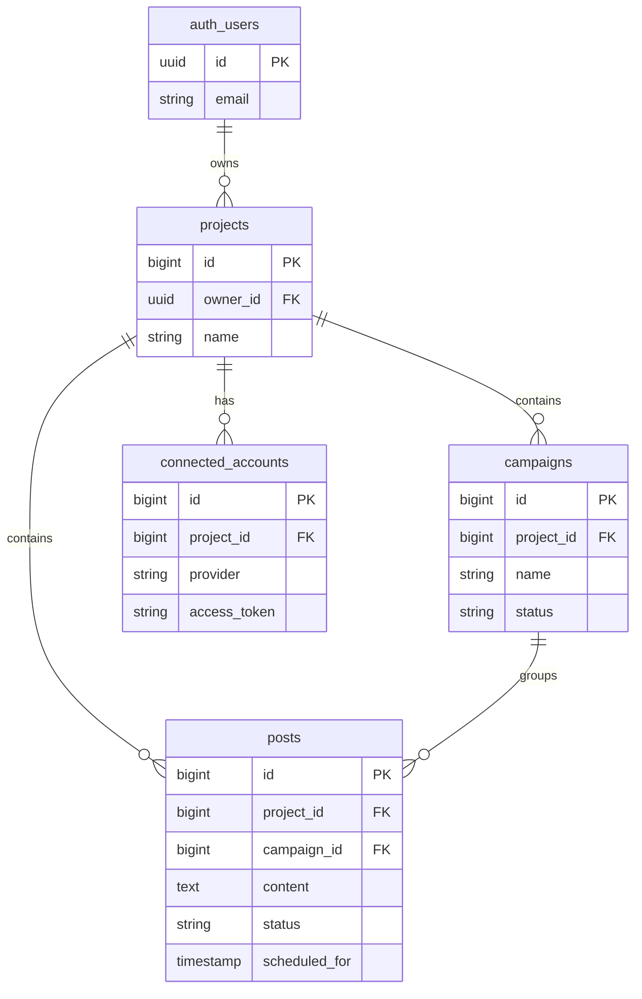

# MODELO DE DATOS SUPABASE (MVP)

## 1. Visión General

Este documento define la estructura de base de datos definitiva para la migración de ARA NeuroPost a Supabase (PostgreSQL). El diseño prioriza la simplicidad, la seguridad mediante RLS (Row Level Security) y la compatibilidad directa con los contratos de API existentes.

### Principios de Diseño
*   **Identidad Gestionada:** Se utiliza `auth.users` de Supabase para la autenticación.
*   **Seguridad RLS:** Cada fila pertenece a un usuario (owner) y solo él puede accederla.
*   **Relaciones Claras:** Uso estricto de Foreign Keys para integridad referencial.
*   **Compatibilidad:** Los nombres de tablas y columnas se mantienen alineados con el ORM actual (SQLAlchemy) para minimizar refactorización en el backend.

## 2. Esquema de Tablas (Public Schema)

### 2.1 Tabla `projects`
Entidad raíz que agrupa toda la configuración y contenido de un usuario/equipo.

| Columna | Tipo | Restricciones | Descripción |
| :--- | :--- | :--- | :--- |
| `id` | `bigint` | PK, Identity | Identificador único del proyecto. |
| `owner_id` | `uuid` | FK -> `auth.users.id` | Dueño del proyecto (Enlace con Supabase Auth). |
| `name` | `text` | Unique, Not Null | Nombre del proyecto/cliente. |
| `description` | `text` | Nullable | Descripción opcional. |
| `created_at` | `timestamptz` | Default: `now()` | Fecha de creación. |

*   **RLS Policy:** `SELECT, INSERT, UPDATE, DELETE WHERE auth.uid() = owner_id`
*   **Nota:** En MVP, 1 Usuario = 1 Proyecto.

### 2.2 Tabla `campaigns`
Agrupador lógico de publicaciones.

| Columna | Tipo | Restricciones | Descripción |
| :--- | :--- | :--- | :--- |
| `id` | `bigint` | PK, Identity | ID de campaña. |
| `project_id` | `bigint` | FK -> `projects.id`, Not Null | Relación con el proyecto padre. |
| `name` | `text` | Not Null | Nombre de la campaña. |
| `objective` | `text` | Nullable | Objetivo estratégico. |
| `tone` | `text` | Nullable | Tono configurado. |
| `status` | `text` | Default: `'active'` | Estado (active, paused, completed). |
| `created_at` | `timestamptz` | Default: `now()` | Fecha de creación. |

*   **RLS Policy:** Heredada. El usuario debe ser owner del `project_id` asociado.
    *   `... WHERE project_id IN (SELECT id FROM projects WHERE owner_id = auth.uid())`

### 2.3 Tabla `posts`
Unidad central de contenido.

| Columna | Tipo | Restricciones | Descripción |
| :--- | :--- | :--- | :--- |
| `id` | `bigint` | PK, Identity | ID del post. |
| `project_id` | `bigint` | FK -> `projects.id`, Not Null | Proyecto padre (para query rápida). |
| `campaign_id` | `bigint` | FK -> `campaigns.id`, Nullable | Campaña asociada. |
| `title` | `text` | Nullable | Título o gancho. |
| `content_text` | `text` | Nullable | Cuerpo del post. |
| `hashtags` | `text` | Nullable | JSON string o texto plano. |
| `status` | `text` | Default: `'pending'` | pending, approved, published, etc. |
| `platform` | `text` | Default: `'linkedin'` | Red social destino. |
| `scheduled_for`| `timestamptz` | Nullable | Fecha programada de publicación. |
| `published_at` | `timestamptz` | Nullable | Fecha real de publicación. |
| `created_at` | `timestamptz` | Default: `now()` | Fecha de creación. |

*   **RLS Policy:** Heredada vía `project_id`.

### 2.4 Tabla `connected_accounts`
Credenciales para publicación (Tokens encriptados).

| Columna | Tipo | Restricciones | Descripción |
| :--- | :--- | :--- | :--- |
| `id` | `bigint` | PK, Identity | ID de conexión. |
| `project_id` | `bigint` | FK -> `projects.id`, Not Null | Proyecto dueño de la cuenta. |
| `provider` | `text` | Default: `'linkedin'` | Proveedor (linkedin, twitter). |
| `external_id` | `text` | Not Null | ID único en la red social. |
| `access_token` | `text` | Not Null | Token encriptado (Fernet). |
| `refresh_token`| `text` | Nullable | Refresh token encriptado. |
| `active` | `boolean` | Default: `true` | Soft delete. |
| `created_at` | `timestamptz` | Default: `now()` | Fecha de vinculación. |

*   **RLS Policy:** Heredada vía `project_id`. Acceso estricto (solo backend debería leer tokens, pero RLS protege acceso directo indebido).

### 2.5 Tabla `user_profiles` (Opcional MVP)
Datos extendidos del usuario.

| Columna | Tipo | Restricciones | Descripción |
| :--- | :--- | :--- | :--- |
| `id` | `uuid` | PK, FK -> `auth.users.id` | Relación 1:1 con usuario Auth. |
| `full_name` | `text` | Nullable | Nombre real. |
| `avatar_url` | `text` | Nullable | Foto de perfil. |

*   **RLS Policy:** `WHERE auth.uid() = id`.

## 3. Row Level Security (RLS) - Estrategia Simplificada

Para el MVP, evitaremos lógica recursiva compleja en RLS. La regla de oro es: **"Todo recurso debe tener una columna `project_id` (o ser el proyecto mismo), y validamos que el usuario sea dueño de ese proyecto"**.

### Políticas SQL (Pseudocódigo)

1.  **Projects:**
    ```sql
    create policy "Users can CRUD their own projects"
    on projects for all
    using (auth.uid() = owner_id);
    ```

2.  **Child Tables (Campaigns, Posts, etc.):**
    ```sql
    create policy "Users can CRUD items in their projects"
    on campaigns for all
    using (
      exists (
        select 1 from projects
        where projects.id = campaigns.project_id
        and projects.owner_id = auth.uid()
      )
    );
    ```
    *Nota:* Para optimizar, se recomienda indexar `owner_id` en `projects` y `project_id` en tablas hijas.

## 4. Suposiciones Explícitas del MVP

1.  **Monousuario:** Un proyecto tiene un solo `owner_id`. No hay tablas intermedias de `project_members` ni roles de equipo (Admin/Editor).
2.  **Auth Gestionado:** El backend (FastAPI) deberá validar el JWT de Supabase en cada petición para extraer el `user_id` y filtrar las consultas SQL (además de la protección RLS a nivel de DB).
3.  **Storage:** Las imágenes de los posts (si se implementan) se guardarán en Supabase Storage en un bucket privado `user-{uid}`, referenciado en una tabla `media` similar a `posts`.

## 5. Notas de Migración desde SQLite

### Riesgos y Ajustes
1.  **Tipos de Datos:**
    *   SQLite `Integer` -> Postgres `BigInt` (Recomendado para IDs autoincrementales).
    *   SQLite `DateTime` -> Postgres `Timestamptz` (Manejo explícito de zona horaria UTC).
    *   SQLite `Boolean` (0/1) -> Postgres `Boolean` (true/false).
2.  **SQLAlchemy:**
    *   El modelo actual usa `Integer` para PKs. Al migrar, asegurarse de que Postgres use `GENERATED BY DEFAULT AS IDENTITY`.
    *   El driver de conexión cambiará de `sqlite://` a `postgresql://` (usando `psycopg2` o `asyncpg`).
3.  **Owner ID:**
    *   La tabla `Project` actual NO tiene `owner_id`. **Acción Requerida:** Al crear la tabla en Supabase, agregar la columna y actualizar el endpoint `create_project` para asignar `auth.uid()` del usuario autenticado.

## 6. Diagrama Relacional Textual


